# Project Map

This file was generated automatically by `project_mapper.py`.
Use it to help AI coding tools understand the codebase before making changes.

## Project Summary

- Root: `/Users/gowtham/Desktop/portfolio`
- Files scanned: `36`
- Dependency edges found: `22`

## Generated Visuals

- Mermaid graph: `PROJECT_DEPENDENCIES.mmd`
- Graphviz DOT graph: `PROJECT_GRAPH.dot`
- Graph image: `PROJECT_GRAPH.png`
- SVG graph: `PROJECT_GRAPH.svg`

## Suggested AI Instruction

> Read this `PROJECT_MAP.md` first. Then inspect the relevant files before editing code. Preserve working behavior and avoid changing unrelated files.

## Entry Points

- `backend/main.py`
- `frontend/src/App.jsx`
- `frontend/src/main.jsx`
- `src/main.jsx`

## High-Level Dependency Graph

```mermaid
graph TD
    N1["frontend/src/App.jsx"] --> N2["frontend/src/components/About.jsx"]
    N1["frontend/src/App.jsx"] --> N3["frontend/src/components/Contact.jsx"]
    N1["frontend/src/App.jsx"] --> N4["frontend/src/components/Cursor.jsx"]
    N1["frontend/src/App.jsx"] --> N5["frontend/src/components/Experience.jsx"]
    N1["frontend/src/App.jsx"] --> N6["frontend/src/components/Footer.jsx"]
    N1["frontend/src/App.jsx"] --> N7["frontend/src/components/Hero.jsx"]
    N1["frontend/src/App.jsx"] --> N8["frontend/src/components/Nav.jsx"]
    N1["frontend/src/App.jsx"] --> N9["frontend/src/components/Projects.jsx"]
    N1["frontend/src/App.jsx"] --> N10["frontend/src/components/Stats.jsx"]
    N1["frontend/src/App.jsx"] --> N11["frontend/src/lib/useReveal.js"]
    N2["frontend/src/components/About.jsx"] --> N12["frontend/src/components/About.module.css"]
    N3["frontend/src/components/Contact.jsx"] --> N13["frontend/src/components/Contact.module.css"]
    N5["frontend/src/components/Experience.jsx"] --> N14["frontend/src/components/Experience.module.css"]
    N6["frontend/src/components/Footer.jsx"] --> N15["frontend/src/components/Footer.module.css"]
    N7["frontend/src/components/Hero.jsx"] --> N16["frontend/src/components/Hero.module.css"]
    N8["frontend/src/components/Nav.jsx"] --> N17["frontend/src/components/Nav.module.css"]
    N9["frontend/src/components/Projects.jsx"] --> N18["frontend/src/components/Projects.module.css"]
    N10["frontend/src/components/Stats.jsx"] --> N19["frontend/src/components/Stats.module.css"]
    N20["frontend/src/main.jsx"] --> N1["frontend/src/App.jsx"]
    N20["frontend/src/main.jsx"] --> N21["frontend/src/index.css"]
    N22["src/main.jsx"] --> N1["frontend/src/App.jsx"]
    N22["src/main.jsx"] --> N23["src/index.css"]
```



## File Summaries

### `README.md`

- Role: Project documentation
- Type: `.md`
- Size: `4262` bytes
- Lines: `167`
- Local dependencies: none detected
- Notes:
  - Reads, writes, or processes JSON-like data.

### `backend/main.py`

- Role: Application entry point
- Type: `.py`
- Size: `3220` bytes
- Lines: `84`
- Local dependencies: none detected
- Functions: contact, health
- Classes: ContactMessage
- Environment variables: FRONTEND_URL, RECIPIENT_EMAIL, SMTP_HOST, SMTP_PASS, SMTP_PORT, SMTP_USER
- Notes:
  - Imports 7 external or internal modules.
  - Defines 2 function(s).
  - Defines 1 class(es).
  - Uses environment variable(s): FRONTEND_URL, RECIPIENT_EMAIL, SMTP_HOST, SMTP_PASS, SMTP_PORT, SMTP_USER.
  - Includes exception handling.

### `backend/requirements.txt`

- Role: Dependency or project configuration file
- Type: `.txt`
- Size: `87` bytes
- Lines: `4`
- Local dependencies: none detected

### `frontend/index.html`

- Role: API server or backend route module
- Type: `.html`
- Size: `1293` bytes
- Lines: `21`
- Local dependencies: none detected

### `frontend/package.json`

- Role: Dependency or project configuration file
- Type: `.json`
- Size: `461` bytes
- Lines: `22`
- Local dependencies: none detected

### `frontend/public/favicon.svg`

- Role: Supporting project file
- Type: `.svg`
- Size: `226` bytes
- Lines: `4`
- Local dependencies: none detected

### `frontend/src/App.jsx`

- Role: Application entry point
- Type: `.jsx`
- Size: `1045` bytes
- Lines: `41`
- Local dependencies:
  - `frontend/src/components/About.jsx`
  - `frontend/src/components/Contact.jsx`
  - `frontend/src/components/Cursor.jsx`
  - `frontend/src/components/Experience.jsx`
  - `frontend/src/components/Footer.jsx`
  - `frontend/src/components/Hero.jsx`
  - `frontend/src/components/Nav.jsx`
  - `frontend/src/components/Projects.jsx`
  - `frontend/src/components/Stats.jsx`
  - `frontend/src/lib/useReveal.js`
- Functions: App
- Notes:
  - Imports 11 external or internal modules.
  - Defines 1 function(s).

### `frontend/src/components/About.jsx`

- Role: Frontend component
- Type: `.jsx`
- Size: `2968` bytes
- Lines: `78`
- Local dependencies:
  - `frontend/src/components/About.module.css`
- Functions: About
- Notes:
  - Imports 1 external or internal modules.
  - Defines 1 function(s).

### `frontend/src/components/About.module.css`

- Role: Supporting project file
- Type: `.css`
- Size: `1356` bytes
- Lines: `76`
- Local dependencies: none detected

### `frontend/src/components/Contact.jsx`

- Role: Frontend component
- Type: `.jsx`
- Size: `3424` bytes
- Lines: `90`
- Local dependencies:
  - `frontend/src/components/Contact.module.css`
- Functions: Contact, handleChange
- Notes:
  - Imports 2 external or internal modules.
  - Defines 2 function(s).
  - Reads, writes, or processes JSON-like data.

### `frontend/src/components/Contact.module.css`

- Role: Supporting project file
- Type: `.css`
- Size: `2485` bytes
- Lines: `123`
- Local dependencies: none detected

### `frontend/src/components/Cursor.jsx`

- Role: Frontend component
- Type: `.jsx`
- Size: `1804` bytes
- Lines: `57`
- Local dependencies: none detected
- Functions: Cursor, animate, onEnter, onLeave, onMove
- Notes:
  - Imports 1 external or internal modules.
  - Defines 5 function(s).

### `frontend/src/components/Experience.jsx`

- Role: Frontend component
- Type: `.jsx`
- Size: `5492` bytes
- Lines: `86`
- Local dependencies:
  - `frontend/src/components/Experience.module.css`
- Functions: Experience
- Notes:
  - Imports 1 external or internal modules.
  - Defines 1 function(s).

### `frontend/src/components/Experience.module.css`

- Role: Supporting project file
- Type: `.css`
- Size: `1609` bytes
- Lines: `101`
- Local dependencies: none detected

### `frontend/src/components/Footer.jsx`

- Role: Frontend component
- Type: `.jsx`
- Size: `365` bytes
- Lines: `12`
- Local dependencies:
  - `frontend/src/components/Footer.module.css`
- Functions: Footer
- Notes:
  - Imports 1 external or internal modules.
  - Defines 1 function(s).

### `frontend/src/components/Footer.module.css`

- Role: Supporting project file
- Type: `.css`
- Size: `448` bytes
- Lines: `22`
- Local dependencies: none detected

### `frontend/src/components/Hero.jsx`

- Role: Frontend component
- Type: `.jsx`
- Size: `3592` bytes
- Lines: `98`
- Local dependencies:
  - `frontend/src/components/Hero.module.css`
- Functions: Hero, TermLine
- Notes:
  - Imports 2 external or internal modules.
  - Defines 2 function(s).
  - Reads, writes, or processes JSON-like data.

### `frontend/src/components/Hero.module.css`

- Role: Prompt or AI instruction logic
- Type: `.css`
- Size: `2344` bytes
- Lines: `112`
- Local dependencies: none detected

### `frontend/src/components/Nav.jsx`

- Role: Frontend component
- Type: `.jsx`
- Size: `1639` bytes
- Lines: `53`
- Local dependencies:
  - `frontend/src/components/Nav.module.css`
- Functions: Nav, onScroll
- Notes:
  - Imports 2 external or internal modules.
  - Defines 2 function(s).

### `frontend/src/components/Nav.module.css`

- Role: Supporting project file
- Type: `.css`
- Size: `2196` bytes
- Lines: `96`
- Local dependencies: none detected

### `frontend/src/components/Projects.jsx`

- Role: Frontend component
- Type: `.jsx`
- Size: `5792` bytes
- Lines: `117`
- Local dependencies:
  - `frontend/src/components/Projects.module.css`
- Functions: Projects
- Notes:
  - Imports 1 external or internal modules.
  - Defines 1 function(s).

### `frontend/src/components/Projects.module.css`

- Role: Supporting project file
- Type: `.css`
- Size: `2973` bytes
- Lines: `154`
- Local dependencies: none detected

### `frontend/src/components/Stats.jsx`

- Role: Frontend component
- Type: `.jsx`
- Size: `649` bytes
- Lines: `21`
- Local dependencies:
  - `frontend/src/components/Stats.module.css`
- Functions: Stats
- Notes:
  - Imports 1 external or internal modules.
  - Defines 1 function(s).

### `frontend/src/components/Stats.module.css`

- Role: Supporting project file
- Type: `.css`
- Size: `872` bytes
- Lines: `39`
- Local dependencies: none detected

### `frontend/src/index.css`

- Role: Supporting project file
- Type: `.css`
- Size: `6214` bytes
- Lines: `268`
- Local dependencies: none detected

### `frontend/src/lib/useReveal.js`

- Role: Frontend component
- Type: `.js`
- Size: `507` bytes
- Lines: `21`
- Local dependencies: none detected
- Functions: useReveal
- Notes:
  - Imports 1 external or internal modules.
  - Defines 1 function(s).

### `frontend/src/main.jsx`

- Role: Application entry point
- Type: `.jsx`
- Size: `235` bytes
- Lines: `10`
- Local dependencies:
  - `frontend/src/App.jsx`
  - `frontend/src/index.css`
- Notes:
  - Imports 4 external or internal modules.

### `frontend/vite.config.js`

- Role: Configuration file
- Type: `.js`
- Size: `261` bytes
- Lines: `14`
- Local dependencies: none detected
- Notes:
  - Imports 2 external or internal modules.

### `index.html`

- Role: API server or backend route module
- Type: `.html`
- Size: `1232` bytes
- Lines: `20`
- Local dependencies: none detected

### `package.json`

- Role: Dependency or project configuration file
- Type: `.json`
- Size: `334` bytes
- Lines: `18`
- Local dependencies: none detected

### `src/data/content.js`

- Role: Frontend component
- Type: `.js`
- Size: `7562` bytes
- Lines: `127`
- Local dependencies: none detected

### `src/index.css`

- Role: Supporting project file
- Type: `.css`
- Size: `4175` bytes
- Lines: `155`
- Local dependencies: none detected

### `src/main.jsx`

- Role: Application entry point
- Type: `.jsx`
- Size: `248` bytes
- Lines: `10`
- Local dependencies:
  - `frontend/src/App.jsx`
  - `src/index.css`
- Notes:
  - Imports 4 external or internal modules.

### `tools/project_mapper.py`

- Role: Developer tooling script
- Type: `.py`
- Size: `35127` bytes
- Lines: `1129`
- Local dependencies: none detected
- Functions: __init__, build_graphviz_graph, build_lookup_tables, collect_files, detect_entry_points, detect_env_vars, detect_python_package_roots, escape_dot, escape_mermaid_label, generate_key_notes, get_node_id, graph_node_attributes plus 22 more
- Classes: FileSummary, ProjectMap, ProjectMapper
- Notes:
  - Imports 10 external or internal modules.
  - Defines 34 function(s).
  - Defines 3 class(es).
  - May handle API keys or secrets. Verify secrets are loaded from environment variables.
  - Contains TODO or FIXME comments.
  - Includes exception handling.

### `vercel.json`

- Role: Supporting project file
- Type: `.json`
- Size: `404` bytes
- Lines: `26`
- Local dependencies: none detected
- Notes:
  - Reads, writes, or processes JSON-like data.

### `vite.config.js`

- Role: Configuration file
- Type: `.js`
- Size: `261` bytes
- Lines: `14`
- Local dependencies: none detected
- Notes:
  - Imports 2 external or internal modules.

## Dependency Edges

- `frontend/src/App.jsx` uses `frontend/src/components/About.jsx`
- `frontend/src/App.jsx` uses `frontend/src/components/Contact.jsx`
- `frontend/src/App.jsx` uses `frontend/src/components/Cursor.jsx`
- `frontend/src/App.jsx` uses `frontend/src/components/Experience.jsx`
- `frontend/src/App.jsx` uses `frontend/src/components/Footer.jsx`
- `frontend/src/App.jsx` uses `frontend/src/components/Hero.jsx`
- `frontend/src/App.jsx` uses `frontend/src/components/Nav.jsx`
- `frontend/src/App.jsx` uses `frontend/src/components/Projects.jsx`
- `frontend/src/App.jsx` uses `frontend/src/components/Stats.jsx`
- `frontend/src/App.jsx` uses `frontend/src/lib/useReveal.js`
- `frontend/src/components/About.jsx` uses `frontend/src/components/About.module.css`
- `frontend/src/components/Contact.jsx` uses `frontend/src/components/Contact.module.css`
- `frontend/src/components/Experience.jsx` uses `frontend/src/components/Experience.module.css`
- `frontend/src/components/Footer.jsx` uses `frontend/src/components/Footer.module.css`
- `frontend/src/components/Hero.jsx` uses `frontend/src/components/Hero.module.css`
- `frontend/src/components/Nav.jsx` uses `frontend/src/components/Nav.module.css`
- `frontend/src/components/Projects.jsx` uses `frontend/src/components/Projects.module.css`
- `frontend/src/components/Stats.jsx` uses `frontend/src/components/Stats.module.css`
- `frontend/src/main.jsx` uses `frontend/src/App.jsx`
- `frontend/src/main.jsx` uses `frontend/src/index.css`
- `src/main.jsx` uses `frontend/src/App.jsx`
- `src/main.jsx` uses `src/index.css`

## Maintenance Notes

Regenerate this file whenever the project structure changes:

```bash
python tools/project_mapper.py
```
